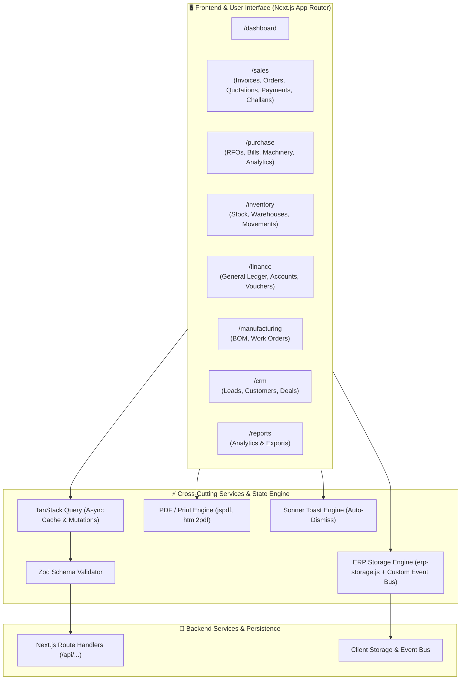
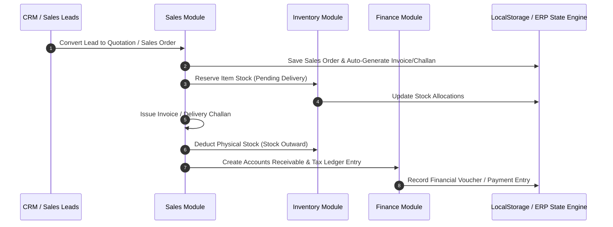

# Suraj ERP — High-Level System Architecture & Execution Flow

This document provides the high-level map of the system: modules, services, data movement, and execution paths.

---

## 🗺️ High-Level System Map (The Shape of the System)

---

## 🔄 Inter-Module Data Movement Flow

### Data Movement Rules Between Business Modules:
1. **Sales ↔ Inventory**: Creating a Sales Order reserves inventory stock; fulfilling an Invoice/Challan triggers stock deduction.
2. **Purchase ↔ Inventory**: Confirming a Purchase Receipt / Bill increments warehouse item quantities.
3. **Sales & Purchase ↔ Finance**: Sales invoices populate Accounts Receivable; Purchase bills populate Accounts Payable and General Ledger.
4. **CRM ↔ Sales**: CRM customer records populate customer dropdowns in Quotations/Invoices.
5. **Manufacturing ↔ Inventory**: Work Orders consume raw material inventory (BOM) and output finished goods to inventory.

---

## 🧭 System Call Order & Traversal

### 1. Root Shell & Context Initializer
- **Entry**: `src/app/layout.js` & `src/providers/theme-provider.jsx`
- **Responsibilities**:
  1. Loads design tokens (`src/app/globals.css`).
  2. Mounts global state providers (Theme, Toast / `Sonner` with auto-dismiss duration).
  3. Renders app navigation layout (Sidebar, Header, Top Bar).

### 2. Module Route Execution
- **Paths**: `src/app/<module>/page.js` (`/sales`, `/purchase`, `/inventory`, `/finance`, `/manufacturing`, `/crm`, `/reports`, `/settings`, `/users`)
- **Responsibilities**:
  1. Next.js App Router matches route to `page.js`.
  2. Mounts module sub-navigation, analytics banners, and TanStack Data Tables.
  3. Triggers data fetching hooks / storage sync events (`erp_document_created`, `erp_customer_created`).

### 3. Component & Form Execution
- **Paths**: `src/components/<module>/...`
- **Responsibilities**:
  1. Client components handling forms (`React Hook Form` + `Zod`), edit modals (`EditDocumentModal`), and print layouts (`/print-invoice`).
  2. Emits client storage mutations and real-time event dispatches.

### 4. Data Storage & API Route Handlers
- **Paths**: `src/app/api/.../route.js` and `src/lib/erp-storage.js`
- **Responsibilities**:
  1. Handles HTTP `GET`, `POST`, `PUT`, `DELETE` requests and local storage persistence.
  2. Validates payloads against Zod schemas.
  3. Manages document deduplication, deletion tracking, and real-time state synchronization.

---

## 🎯 Current Modification Scope Marker

Whenever modifying code, specify which segment of the system path is being modified:

- **[ ] Root Shell**: `src/app/layout.js`, `src/providers/theme-provider.jsx`, `globals.css`
- **[ ] Module Page Entry**: `src/app/<module>/page.js`
- **[ ] Component UI / Form**: `src/components/...`
- **[ ] Data Access / State Engine**: `src/app/api/...`, `src/lib/erp-storage.js`
- **[ ] Project Config / Agent Docs**: `package.json`, `pnpm-workspace.yaml`, `.npmrc`, `.agents/AGENTS.md`
